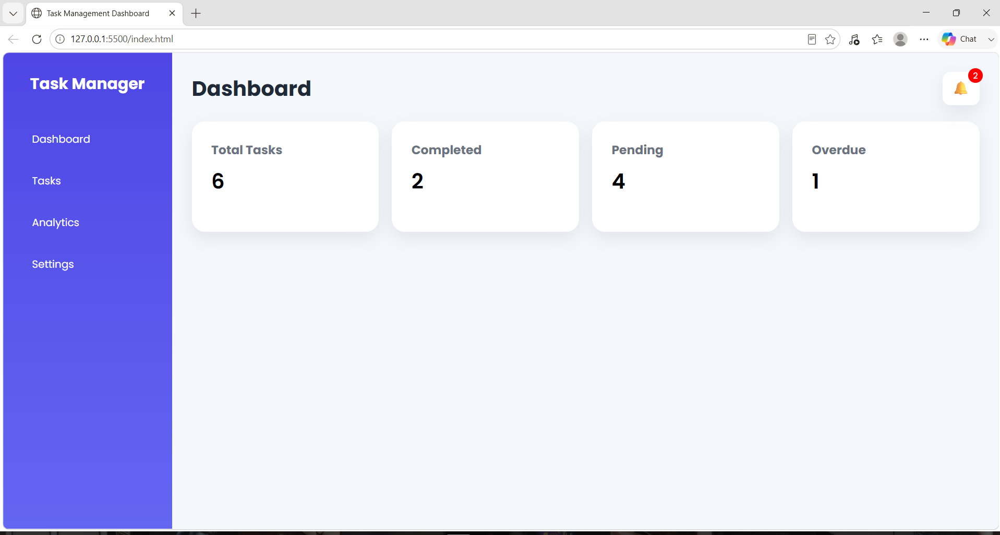
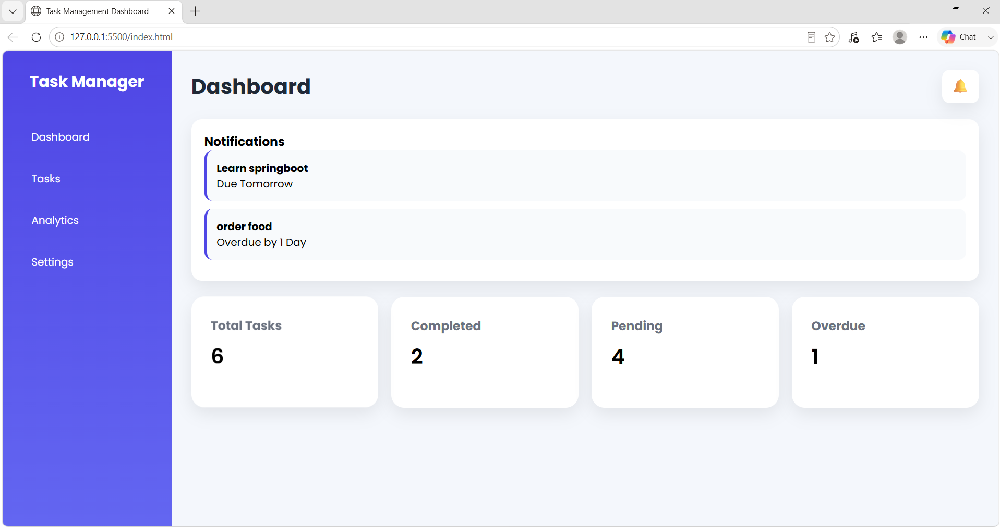
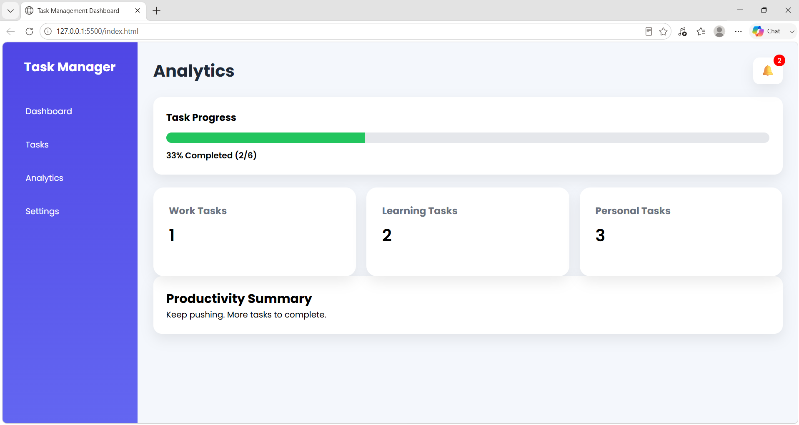
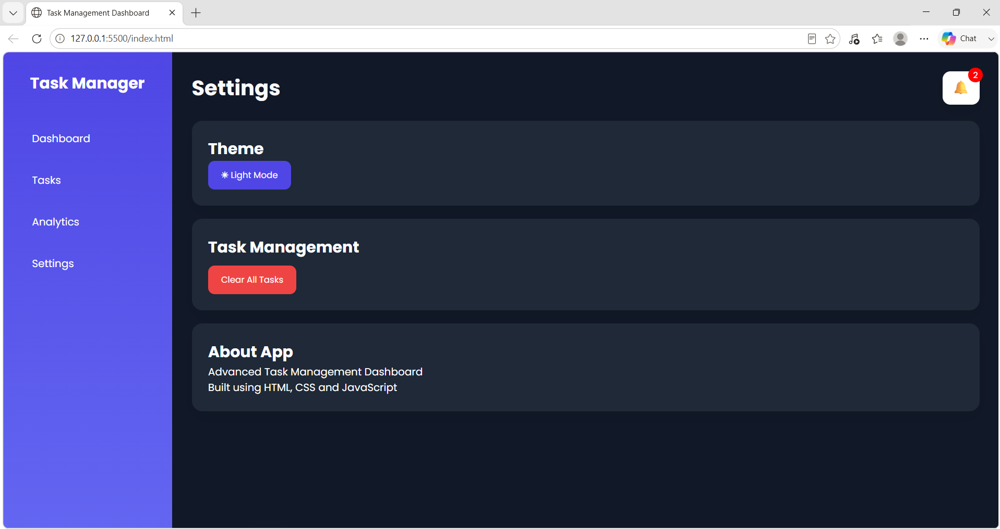

# 📋 Advanced Task Management Dashboard

A modern and responsive Task Management Dashboard built using **HTML, CSS, and JavaScript**. The application helps users manage tasks efficiently with features such as task tracking, notifications, analytics, dark mode, and local storage support.

---

## 🚀 Features

### Task Management

* Add new tasks
* Edit existing tasks
* Delete tasks
* Mark tasks as completed
* Persistent task storage using Local Storage

### Search & Filters

* Search tasks by title
* Filter tasks by:

  * All Tasks
  * Pending Tasks
  * Completed Tasks

### Notifications

* Notification center
* Due today reminders
* Due tomorrow reminders
* Due in 2 days reminders
* Overdue task notifications (up to 2 days)
* Notification badge counter
* Click notification to jump directly to the task

### Analytics Dashboard

* Task progress tracking
* Completion percentage
* Work task count
* Learning task count
* Personal task count
* Productivity summary based on completion rate

### Settings

* Dark Mode / Light Mode
* Clear All Tasks
* Application information section

### User Experience

* Responsive design for desktop, tablet, and mobile devices
* Modern UI design
* Interactive task cards
* Smooth animations and transitions

---

## 🛠️ Technologies Used

* HTML5
* CSS3
* JavaScript (ES6)
* Local Storage API

---

## 📂 Project Structure

Task-Management-Dashboard/

├── index.html

├── style.css

├── script.js

├── README.md

└── screenshots/

    ├── dashboard.png

    ├── tasks.png

    ├── edit-task.png

    ├── notifications.png

    ├── analytics.png

    └── settings-darkmode.png

---

## 📸 Screenshots

### Dashboard

### Tasks Page

### Edit Task

### Notifications

### Analytics

### Settings & Dark Mode

---

## ▶️ How to Run

1. Download or clone the repository.
2. Open the project folder.
3. Open `index.html` in your browser.
4. Start managing your tasks.

---

## 🎯 Future Enhancements

* Export and Import Tasks
* Task Categories Management
* Drag and Drop Task Sorting
* Calendar View
* User Authentication
* Cloud Data Storage

---

## 👩‍💻 Author

**Roopika Nallanagula**

Built as a portfolio project to demonstrate front-end development skills using HTML, CSS, and JavaScript.
